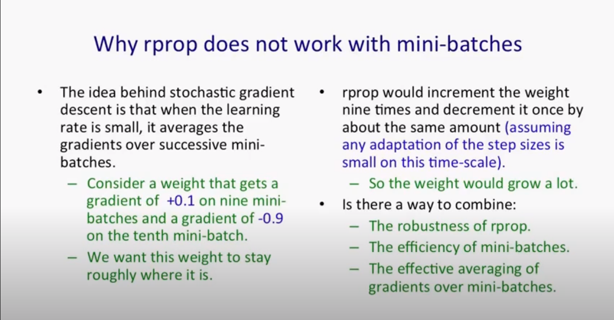
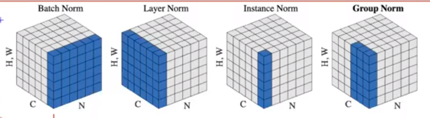
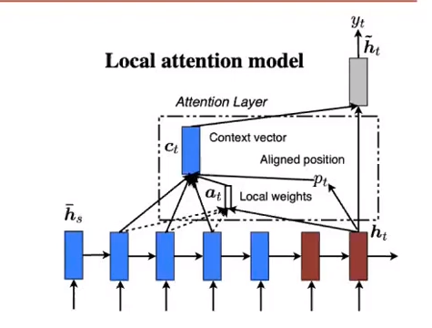

## Reference

- [Course](https://github.com/maziarraissi/Applied-Deep-Learning)
- [Repo with the slides, and course info](https://github.com/maziarraissi/Applied-Deep-Learning)

## Deep Learning overview

- we can look at deep learning as an algorithm that writes algorithms, like a compiler

* in this case the source code would be the data: (examples/experiences)
* excutable code would be the deployable model

- Deep: Functions compositions $ f*l f*{l-1} .... f_1$
- Learning: Loss, Back-propagation, and Gradient Descent

- $ L(\theta) \approx J(\theta)$ --> noisy estimate of the objective function due to mini-batching. That's why we call it stochastic Gradient Descent
- why do we use the first order derivative, not the second order one (the hessian), because order of first order derivative is N, but for the hessian it's N\*N, so it's computationally expensive and slow

### Optimizers

- to make gradient descent faster, we can add momentum to it.
- another way is to use Nesttov Accelerated Gradient: the idea is to look ahead while computing the gradient, so we can add that to the momentum

- RMSprop: A mini-batch version of rprop method. the original rprop can't work with mini batches, as it doesn't consider the magnitude of the gradient, but only the sign of it, and it would multiply the gradient by a fixed factor every time depending on the sign.

- Nestrov adaptive optimizer: the main idea is that we know that we gonna update the weights according to our average velocity so far, and also our gradient, but this can cause us to over shoot as we have a huge velocity moving down the hill, so why not update first the weights according to our velocity and see where that gets us (the look ahead term), and then we update the weights according to the gradient there

- Adam:
  - can take different time steps for each paramater (Adaptive steps) (took concepts from Adadelta)
  - can also has momentum for all parameter wich can lead to faster convergence
- Nadam: Just like Adam but with added nestrov acceleration look ahead functionality so we can slow down we go near the goal

## Dropout

- A simple method to prevent the NN from overfitting
- CNNS are less prune to overfitting becaue the weight sharing idea, that we have a set of filters fot the entire image
- you can look at dropout as a smart way of ensembling, as it combines exponentially many different networks architectures effienctly.

# Computer Vision

## Image Classification

### Large Networks

#### Network In Network

- the main idea is to put a network inside another network

- they introduced multi layer preceptron conv layer which is a conv layer followed by a few FC layers
- this idea is bisacally a (one to one convution)
- they introduced a global averaging pooling: insted of adding a bunch of FC layers at the end of teh conv architecture, we can just average multible channels from the last conv layer to form the output layer

- one by one convolution is a normal convolution with fliter size of 1 by 1

- in conv net, we want the network to be invariant both localy and globaly, which means we still predict the photo is for a dog, even if the dog had slight shift in pixels (local invariant), and also of the dog went to be in the lower corner of the pic isntead of the upper one (global invariant)
- we can achieve local invariant with pooling, and deal with global invariant with data augmentation

#### VGG Net

##### Local Response Normalization:

- the idea is to normalize a pixel across nearing channels

- after comparing nets with lrn and nets without, they didn't find big difference, so they stoped using it

##### Data Augmentation

- Image translations( random crops), and horizontal reflection
- altering the intensities of the RGB channels
- scale jittering

#### GoogleNet

- You stack multiple inception modules on top of each ohter
- the idea is that you don't have to choose which filter size to use, so why don't use them all
- to make the network more efficient, they first projected the input with one by one convolution then applied the main filters
- you concatinate the many filters through the channel dimension

#### Batch Normalization

- The main goal of batch normalization is to redude the `Internal Covariant Shift`

- we can just normalize the inputs and it would work fine
- the problem is that in each following layer, and statistics of its output would depend on its weights
- so we also need to nomalize the inputs in hidden layers
- here, the gradient is also going through the mean and variance operations , so it gets a snese of whats gonna happen

- in inference we can't have batch-dependant mean and variance, so we use the average mean and variance for the whole dataset

##### conv layers

- for conv layers we apply normalization across every channel for every pixel in the batch of images
- the effective bach size would be ==> m*p*q where m is the number of images in the batch and
  p,q are the image resolution

##### Benifits of batch norm:

- you can use higher learning rate, as the training is more stable
- less sensitive to initialization
- less sensitive to activation function
- it has regularization effects, because thre's random mini batch every time
- preserve gradient magintude ?? maybe --> because the jacobian doesn't scale as we scales the weights

#### Parametric Relu:

$ f({y_i}) = \max(0,y_i) + a_i \min(0, y_i) $

- if $a_i = 0$ --> Relu
- if $a_i = 0.01$ --> Leaky Relu

- the initialization of weights and biases depends on the type of activation function

#### Kaiming Initialization (I didn't fully understand the heavy math in this lecture, as Im still weak in statistics and variance calculations):

- professor went into deep mathematical details into how to choose the intial values for weights

* the main idea is to investigate the variance of the response in each layer, so we start by calculating the variance for the output of the layer, and we end up with many terms of the weights multiplied together, so to prevent it it from vanishing or exploding, we want the weights to have values centred around 1

#### Label smoothing regularization

- the idea is to reagularize the notwork by giving random false labels for a few examples of the dataset

#### ResNet

- The main idea is to make the NN deeper so that it becomes better, but the idea is that when you do that, the network gets worse, so we can fix that by adding a resdual connection.

##### Identity mapping in resnets

- the idea is to do no non-linear operations on the main branch(identity mapping), so that the keep a deep flow of the data both in forward and backward pathes

#### Wide Residual Networks

- an attempt to make resnets wider and study if that would make them better

#### ResNext

- just like resnets but they changed bottleneck blocks with group convolution block

#### Squeeze-and-Ecxcitation Networks

##### Squeeze : just a global averaging step

##### Excitation: is just a fully connected newtwork

##### Scaling : multiply every channel with the corresponding exctitiaiton value, more like attention

- scaling is you paying different attention to different channels like attention models

#### Spatial Transformer Network

- the main idea is to seperate the main object in the image, like putting a box around it and then this box can be resized, shifted, rotated. so in the end we have a focused image that has only the object, and so we can apply convolution on it and it would be easy then

- the idea is to first find a good transformation parameters theta, you can do that using NN
- then for every position in the output image, you do a bilinear sampling from the input image

#### Dynamic Routing between capsuls

- the idea is to make the outputs of the capsule has a norm that is the probability that an object is presenet

### Small Networks

#### Knowledge Distillation

- the main idea in to use an artificial data coming from the gaint model, using the normal training dataset and a smoothed the output from the giant model. then we train the distilled model using this dataset and with the same parameter `T` that we used to smooth the data. then in production we set the temperature parameter to 1 and use the distilled model for inference.

#### Network Pruning:

- all connections with weights below a threshold are removed from the network
- weight are sparse now
- then we can represent them using fewer bits

#### Quantization

- we basically cluster our weight to some centroids
- the number of centroids for conv layers are more than the ones for FC layers why:
  - because conv layer filters are already sparse, we need higher level of accuracy in them
  - FC layers are so dense that we can tolerate fewer quantization levels

#### Huffman Coding

- store the more common symbols with more bits

#### Squeeze Net

- the idea is to squeeze the network by using one by one convolution thus use one smaller firlter sizes, then expand to make up for the squeeze that is made
- the main idea is to use one by one comvultion to reduce the dimensionality

#### XNOR-NET

- the idea to to convert the weights and inputs to binary values, and so we save a lot in memory and computation
- the idea is to use a pre trained weights, then you try to binariez the weights by trying to approximate ==> $W = \alpha \* B $ where alpha is postative 32 bit constant and B is a binary matrix
- then mean we try to train by using a means square error loss function of the original weights and alpha and B

- I still can't fully understand how to binarize the input

#### Mobile Nets

- the idea is to reduce computation complexity by doing c onv for each channel separately, and not across channels.
- so we use number of filters as the same as the input channels
- but then we will end up with output size as the input size, so we still need to do one by one convolution to output the correct size

#### Xception

- unify the filters sizes for the inception, and then apply them for each channel separately, then do one by one convolution to fix the output size

#### Mobile Net V2

- the same as MobileNet, but with Residuals connections.

#### ShuffleNet

- the idea is to shuffle channels after doing a group convolution

### Auto ML

- the question is can we automate architicture engineering, as we automated feature engineering in DL?
- we can use RNN to output a probability, to sample an architicture from, then use train using this arch, and give the eval acc, as a feedback to the RNN

#### Regularized Evolution

- it's basically random search + selection
- at first you randomly choose some architecture train, and eval on it and push it to to the population
- then you sample some arch. from the population
- then u select the best acc model from your samples , and then mutate it (ie. change some of its arch.), then add it to your samples
- then remove the oldest arch. in the population
- you keep repeating this cycle till you evolve for C cycles (history size reaches the limit) and report the best arch.

#### EfficientNet

- the idea is that we do grid seach on a small network to come with the best depth scaling coefficient `d`, width scaling coefficient `w`, and resolution scalling coefficient `r`, then we try to find scaling parameter $\phi$, that gives the best accuracy while maintaning the `flops` under the limit

### Robustness

- The main goal is to make your network robust against adverarial attacks

#### Intrigiong peroperties of neural networks

- there's nothing special about individual units, and the individual features that the network learn, and they you can interpret any random direction. So, the entire spacd matters
- neural networks has blind spots, this means you can add small pertirbations to an image, they are not noticable to the human eye, but they make the network wrongly classify the image
- Adversiral examples tend to stay hard even for models trained with different hyper-parameters, or ever for different training datasets

- you can train your network to defend against attacks but that's expensive, as: first, you have to train your network, then train it again to find some adversiral attacks, then add those examples to the training set, and finally train for a third time.

- small perturbation to the image, leads to huge perturbation to the activation, due to high dimensionality

#### untargeted adversiral examples

- fast gradient sign: using the trick of the sign of the loss gradient, and add it to the original image to generate an adversiral example
- then you can just add a weighted loss, one for the orginal example, and another for the adversiral one, so that the network would be more robust to adversiral examples

#### Towards Evaluating the Robustness of Neural Networks

- another way to generate targetted adversiral examples is: to choose a function that forces the network to make the logits for the targeted example the biggest, so that this class is selected.

### Visualizing & Understanding

- now we want to debug our network, to understand how it works
- so we want do a backward pass, by inverting our forward pass, but then we habe a problem with pooling layers as we subsamples the input.
- so we store the locations for the max pixels that we choose in our pooling operation, so that we can upsample the input again in the backward pass.
- we call these max locations, switches
- the main idea is, visualising the feature maps, gonna help you modify the network
- you can have two models that have the same output for the same input but which one do you trust more?
  - to answer that, you need to see which features each one of them focuses on, so if one of them focuses on features that are important to classfication, then this model is more trustworthy

#### LIME: Local Interpretable Model-agnsortic Explanations

- you want to trust the model, meaning that you wanna make sure the model prioritized the important features
- but you can't interpret non linear models, so the idea is to make a locally linear model, that have the same output for your local input example, then use this linear model to get the features that the model prioritized

#### Understanding Deep Learning Requires Rethinking Generalization

- NN are powerful enough to fit random data, but then it will not generalize for test data
- so when we introduce radom labels, random pixels, etc: we still can go for 0 train loss, but for test data, the error is gonna be equal to random selection.
- so, this means: The model architecture itself isn't a sufficient regularizer.

- Explicit regularization: dropout, weight decay, data augmentation
- Implicit regularization: early stopping
- there exist a two-layer NN with Relu activation, that can fit any N random example

### Transfer Learning

- labled data is expensive
- you split a data set in half,we find that transfer learning for the same task, have higher acc'
- transfer learning with fine-tuned weight is better than locking the learned weights
- on average you just wanna cut the network in he middle and start learingn after few layers, as the first few layers ar more general leayers and can acctually help you in traninge for another task

#### DeCAF

- first layers learn low-level features, whereas latter layers learn semantic or high-lebel features

## Image Transformation

### Semantic Segmentation

- you want to segments different classes in the image
- The fully connected layers can also be viewed as convoluting with kernels that cover their entire input regions.

#### Atrous Convolution:

- you don't wanna lose much info when you do conv, and then upsample again, so you fill your filter with holes, so that you lose less info
- reduce the degree of signal downsampling

#### CRF:

- deals with the reduced localization accuracy due to the Deep Convolution NN invariance

#### Dilated Convolution:

- basically atrous convolution
- increases the size of the receptive points layer by layer

### Image Super-Resolution

- we want to develope a NN that can up-sample images
- we can do that using convolution
- and in the middle we use one to one convolution to work as non-leaner mapping

### Perceptual Losses

- mse isn't the best for images, for example, if we shift an image by one pixel in any direction, we will end up with huge loss, while the two images are the same
- the idea it to use a CNN like VGG-16 to calculate the loss, this works because any CNN would have some perceptual understanding of the images
- so we push the output of our model, and the target (label) through a NN, and compare the feature maps on different layers

#### Single Image Super-Resolution(SISR)

- the idea is to make the network to only learn the residual not the full image, so it just learns the difference between the two images

## Object Detection

### Two Stage Detectors

#### R-CNN

- we enter the input image into extract regions algorithm. this algorithm is cheap algorithm that output millions of boxes per image. we do that using an algorithm called "selective search"
- we then enter that to a CNN to do features extractions
- at the end we have a per-class classifier

#### Spatial Pyramid Pooling

- the idea is that we use spatial pyramid pooling to have a fixed length representation for the image
- also we push the input image once through the conv layers, then choose multiple windows after to do the classification for. this way we cut so much on computations cause we for the first few conv layers, we pushed just one image

#### Fast R-CNN

- just like RCNN but, changed the multi-class SVM with multi-task loss, this way we don't have to calculate many classifiers, one for each class.
- also we don't need bounding box proposals, and we can acc train a Region Proposal Network, to propose bounding boxes for every pixel in the feature map.
- last trick is to use a CNN instead of the FC head at the end of the network, but CNN is translation invariant, so we need to do pooling for each region separately.

#### Feature Pyramids

- the idea is that we need to use different versions for our input image, each with different resolution, so that we detect objects with different sizes.
- to do that we can use the different features maps at different layers, so that at each layers the resolution changes, and we can use that to choose our windows
- the problem is that each layer represent a different semantic meaning of the image, so the first few layers consider the image colors, while the last few consider the more complex shapes of the image
- to overcome this, from each layer we add a connection to the layer below
- so we up sample the feature maps first then do one by one convolution to adjust the number of channels,

### One Stage Detectors

#### YOLO

- we want the detector to be realtime, so we can detect objects live
- divide the input image into S \* S grid
- if the center of an object fell inside a cell, that cell is the one responsible to detect that object
- each grid cell gonna predict, B bounding boxes, each with confidence score

#### SSD: Single Shot MultiBox Detector

- we want to take the speed from YOLO, and the high acc from the two-stage detectors
- unlike YOLO, we can use early layers, not just the last layers of the network, and for each one we can predict more boxes, so we end with much more boxes than YOLO

#### YOLO9000 - YOLO V2

- Tries to improve upon YOLOv1 using idead from fast-CNN and SSD
- we can use higher res images in training
- can the anchor boxes from the training images not just randomly
- introduced passthrough layer
- used hierarchical classification to extend many classes

## Video

### Large-scale video classification

- we would have a context stream which learns features on a low res frames.
- and a Fovea Stream, which operates on a high res middle portion of the frames

#### Early Fusion

- the idea is to take a few frames from the middle of the clip, and apply conv on them, the only diff is that we add a new dimension to filters which coreespond to the number of frames
- that's just for the first layer, but then it's normal conv

#### Late Fusion

- we have two separate single-frame networks, each one takes a diff frame from the clip, and we concatenate them in the end

### Two-Stream CNN for action recognition

- video can be decomposed into spatial and temporal components

#### Optical flow stacking

- we can just follow pixels from frame to another, and then create a flow vectors, in the x,y axis
- then we can stack these flow vectors

#### Trajectory stacking

- follow the point from frame to another

### Non-local Neural Network

- the idea is that we want to see for output pixel, which areas did it pay attention to in the input
- so we attention every output with all possible pixels in the input
- if we are using it with videos, then we add another dimension for the time

### Group Normalization

- Batch norm, is good as long as we have reasonable batch size
- but whe we have very small batch size, then batch norm isn't the best

**Here's diff between normalizaiton methods:**

# Natural Language Processing

## Word Representation

### Distributed Representation of Words and Phrases and their Compositionality

#### Word2Vec ( Efficient Estimation of Word Representation in Vector Space )

- using CBOW model, or skip-gram model
- uses the cosine-similarity distance function

##### Skip-gram Model

- Continuous Bag of Words is the opposite of the skip-gram in the sense of what are we predicting (word vs context)

- the idea is that you pick a word, and try to predict the context around it
- so you have a word in the middle and try to predict words around in (before, and after), given a defined window size
- and our objective is to maximize the liklihood of the context given the reference word
- we can use binary trees, to do an approximation, and speed up the softmax caculation, as for every word in the vocab, we would calculate it's softmax with all other words,but now we can use binary trees, and do that in just log(n), using an approximation, that we group words together, and in each level coming from the root, we go right or left, till we reach the word in the leaves
- we can make this even faster, using huffman encoding to assign shorter paths for more frequent words

- noise sampling: the idea is to give the model negative samples, that doesn't appear together, and give it low probability

###### Evaluation

- we can evaluate the model, using syntactic, and semantic analogies
- for example, Berlin to Germany is like France to Paris

#### GloVe: Global Vectors for Word Representation

- the idea is to use:
  - global matrix factorization methods
  - local context window methods
- we compute a co-occurrence method, that holds the counts every two words come after each other, we try to learn two matrieces and two biases, that log(X) = w1 \* w2 + b1 + b2

## Text Classification

### Recursive deep models for semantic compositionality over sentiment Treebank

- the dataset is presented as a tree with leafs as words
- the idea is that for evert word we get it's embedding, then we multiply that by a weight matrix, and apply softmax, so then we have probability distribution over our classes (sentiment classes)
- then we can concatenate every words together, and keep recursing till we finish the whole sentence
- the problem with this model, is that we are losing the pair wise interaction between the two words,
- wat we can do it introduce a tensor V, that would capture this interaction

### CNN for Text Classification

- we want to use CNNs with text, so we would have some filters
- the idea is to treat sentences as one dimensional vector, and then we can apply windows that contain bunch of words to some filters, and aggregate them

## Doc2Vec

- as we have representation of words, we can also have the same for sentences, or documents

### Bag of words

- for each sentence, count the frequency of each word in your vocab

#### weakness

- lose ordering or words
- lose semantics or words
  - "powerful" should be closer to "strong" than "Paris"

### Paragraph vector

- for every paragraph, we would have a vector representing it, then we can average those together, and try to get the target paragraph
- we can do it as CBOW, and instead of words, we would have paragraphs

## FastText

- the idea is that we take a sentence(a bag) of words, or N-grams and then sum their vectors together, then project them to latent space, and then project them again to output space, and apply non-linearity (softmax for example), then apply cross-entropy as a loss function
- we can also normalize our bag of features (the word representation), so we down weight most frequent words
- instead of softmax, we can use hierarchial softmax, to decrease the training time
- this model is super fast, and gives results similar to non-linear complicated models like CNNs

## Hierarchial Attention Networks for Document Classification

- the idea is that we want to do document classification
- so in the end we want to represent the document by a vector, that we can enter to softmax, and then output a class
- we can use think of document as they are formed of sentences, and sentences are formed of words
- so we can use GRU based sequence encoder to represent words and then sentences

### GRU

- we have a reset gate, and update gate
- the idea is that at every step we have a previous hidden output, and a current input
- then we have an update gate that determines the percentage to take from the current hidden output, vs the previous hidden output.
- then we also have a reset gate, which determines how much we wanna take from the previous state when calculating the current state
- we use the tanh function to calculate the hidden state
- we use the sigmoid to calc the parameter Z, which tell us the percentage between the current state, and the previous state output

- we can have a forward, and a backward GRU, and concat them
- then we project these concat words representation, and apply non-linearity
- then to calculate the sentence vector out of these word vectors, we apply a weighted average on them.
- this works like a simplified version of attention
- we can do this weighted average using softmax, but first we need to turn this vector to a scaler, which we can do by applying dot product with "query" or "word context", like we are doing a query: what is the informative word
- this will get us with the alphas, which tell us how much we take from each word vector

- NOTE: cross-entropy with one-hot vector is the same as the log-liklihood

## Neural Architecture for Named Entity Recognition

### LSTM-CRF Model

#### Normal LSTM

- has 3 gates, input gage, forget gate, output gate.

#### Conditional Random Field

- in NER, the named tags are dependant on each other, for example: `B` tag, and `I` tag.
- so we want to account for that in our loss
- to do that we introduce a new compatibility matrix, to count for this dependency

#### Character-based models of words

- we need it cause, in production, we might encounter new unseen words, so we make up for that using the character encoding
- we want to add character representation with our words representation
- so we do a character-based bi-LSTM
- and we concatenate the output of the LSTM, with our word representation from the lookup table

## Universal Language Model fine-tuning for Text Classification (ULMFiT)

- Language Model: a model that trying to give an understanding for language. Like given few words of the sentence, can we guess the next word.

### Disctimonative fine-tuning

- so the idea is to split the model pre-trained parameters for each layer
- and to also choose a learning rate for each layer
- the early layers would have smaller learning rate, so their weight wouldn't update as much

### slanted triangular learning rate

- the idea is just to increase the LR gradually, till some point, then decrease in again
- and we do the increase and decrease linearly, so we end up with the triangular shape

### gradual unfreezing

- gradually unfreezing parameters through time

## Natural Machine Translation bu Jointly Learning to Align and Translate

- we wanna model the conditional probability $ p(y|x)$. where x is the source sentence, and y is the target sentence

### RNN Encoder-Decoder

#### Encoder

- the encoder gonna encode our entire sentence into a single vector c
- we can use LSTM, which will output a sequence of vectors $ h_1, h_2, \dots ,h_T$. we can choose c to be just the last vector of the LSTM $h_T$

### Decoder

- we can model $p(y|x)$, as that product of $y_i$ for i from 0 to input time T.
- but we can do an approximation, that instead of X, we calc using C which is a representation of X.
- and instead of using the previous Y outputs in previous time steps, we can use the previous hidden state

### BLUE Score ( Bilingual Evaluation Understudy )

- [Good reference](https://www.youtube.com/watch?v=DejHQYAGb7Q)
- provides an automatic score for machine translation
- the normal precision gives terrible results
- they introduced a modified precision score, which gives score to words up to the maximum number of occurrences in the reference sentences
- we need also to account for different grams.
- for example, for bi-grams, we would count the bi-grams in the output, and count-clip them at the maximum of the bi-gram in the reference sentences
- Pn = BLUE score on n-grams only
- Combined Blue score: Bp exp(1/n \* sigma(Pn))
  - Bp: brevity Penalty
  - it basically penalize short translations
  - Bp: is one if output is longer than reference
  - otherwise, it's exp(1 - (output length / reference length))

## Sequence to Sequence Learning with Neural Networks

- One limitation of RNNs is that the output sequence, is the same length as the input sequence
- this is using two different LSTMs one for input, and one for output
- it stacks multiple LSTMs together creating deep LSTM
- reversing the order of the words of the input sentence
  - the intuition is that the first of the output is gonna take most info from the first tokens of the input

## Phrase representation

- they combined DL approaches like RNNs, with statistical ML approached to enhance the translation
- we cen learn word embedding from the translation task

## Attention-based Neural Machine Translation

- attention solves the problem of decreasing Blue-score with increasing the sentence length

### Global Attention

- with previous approaches, we used a small version of attention, to choose which source vector would have the bigger weight
- in this version we do the same, but with different, source-target hidden state vectors
- so we attend source and target hidden state vectors

 

### Local Attention

- instead of attending to all of the input space, we can jus attend to a portion of it
- it's faster than global attention
- how to choose the portion to attend to, is learnable

 

## Byte Pair Encoding

- the main objective is to reduce the amount of unknown words
- the idea is to iterate over the bytes in the sequence and pick the most frequent one and replace it with an unused byte
- a byte is a character, or a sequence of characters
- we keep doing that till we convert our input sequence to bunch of bytes
- at test time, we would have Out Of Vocab words, but we can convert them to known bytes that we extracted in training.
- we are trying to find a balance between word-encoding and character-encoding

## Google's Neural Machine Translation

- the first paper to beat statistics MT methods
- we will use encoder RNN to encode the input
- then we will use attention, to attend to the input
- they added 8-layer LSTM with residual connection
- they used (Byte-Pair) word-pieces technique
- the loss function, is the log likelihood of the output, conditioned on the input, but we wanna to add the GLeu score to penalize depending on the quality of the translation, so we can add the Gleu score to the loss function as a reward, in RL
- the did beam-search which penalized small sentences, and added penalty for long sequence contexts
- lastly, they quantize the model, and its parameters in inference

## Convolution Sequence to Sequence Learning

- we want to use the parallelization of the CNNs to learn seq-to-seq
- we add positional embedding to account for the different sentence positions. we didn't need to do this for RNNs as they process words sequentially by default
- The network has and encoder, and a decoder
  - the encoder, process all input
  - the decoder, only considers the previous inputs
- we have a stack of conv blocks
- for each convolution block, you take a k words, each is d dimensional, then you flatten them to be (kd) dimensional, and apply convolution, which is multiplying by filter of size (2d,kd), then you have an output of (2d) dimension. you talk the first half and dot product it with the sigmoid of the second half. there we applied the non-linearity.
- and for each block, we also add residual connection.
- lastly, we add attention between our encoder blocks output, and the decoder blocks output

## Attention Is All You Need

- in RNNs and CNNs, there's this inductive bias, that the useful information, is right next to us. while, is Attention we don't assume that
- Just as all attention based models, we need to add positional encoding
  - they do that by fourier expansion
- all previous work was cross attention between encoder, and decoder
- here they introduced, self-attention, where the encoder attend to its inputs
- Then the added residual connection and layer normalization

### One Head Attention

- we have Query, Key, and Value.
  - we multiply each of them with a weight matrix to add learnable parameters
- first, we do attention between, the query and the key, they we down-scale the dot product by the square root of the embedding dimension.
  - we choose the square root, because it's not big nor small number, so we keep the attention weights in a reasonable range
- then we do a weighted sum between the attention weights and the Value matrix

### Multi Head Attention

- then one the most important ideas here is multi-head attention
- we make many single head attention, then concatenate them together

### Decoder

- the same as the encoder
- the main difference, is that we do masked attention, which only attend to previous outputs only
- Here, the query is coming from the output sequence, and the key, and value, are coming from the encoder

## Subword Regularization

- we want to have my many Subword tokenization for the same word
- the multiple subword tokenization works like kind of data augmentation, and also adds a regularization effect

## Transformers are RNNs

- The idea is that we don't have to use softmax fuction, to caputer the similarity between two tokens, we can use any other suitable function.

## ELMo

- We need to have multible word representation for the same words, depending on the context.
- we take all hidden repreasentations from all LSTM layers, in both forward, and backward

- we then take the Elmo representation, and add it to the different tasks, we can add it in the input or the output, for our task-specific network
- we can aslo finetune the elmo parameters in the downstream tasksdd

### Forward language model

- you predict the next word given the previous words

### Backward language model

- you predict the next word given the next words

## GPT1

- Just like Elmo, but use transformer decoder, instead of Lstm
- your hidden repersentation contains, token embedding and position embedding

- you have two outputs (heads)one for the downstream task, and another for the text prediction
- Loss function is weighted average of the two losses

## Bert

- same concept of pre-training and fine-tuning
- uses transformer encoder
- you start by masking some of the input tokens
- task two, is doing "next sentence prediction"
- we traing the model on those two tasks
- Position Embeddings could be learnable or fixed

## GPT2

- we used to predict the next word or sympol conditioned on previous words or tokens
- it would be way better to condition on also the given task
- we want to do 'model-agnostic meta-learning'
- they changed the input format to be probpts like `translate to Arabic, English text, Arabic text`

- intersting thing about language, is that NLP tasks are similar
- so they was able to answer some task-specific questions using zero-shot learning just based on the input prompt

## ALBERT

- they did factorized embedding parameterization
- this does huge parameter reduction
- it has cross-layer parameter
- they changed the second task 'NSP' to `sentence-order prediction`, and this task is harder than the previous one, as the negative examples would be harder to lear, as the positive examples and negative ones are the same two sentences swapped
- they found that removing dropout helps the training

## Roberta

- bert was biased towards the masked tokens, so to fix that, they didn't mask all selected mask-tokens, but masked them with 80%, and left them unchanged with 10%, and replaced them with random vocab with 10%

- Modifications on top of Bert:
  - bigger dataset
  - train for longer time
  - change the masking pattern a bit
  - replace NSP, with POS (forces the model to learn harder task, by flipping the order of two consequtive sentences)
  - bigger bathces and bigger number of tokens

## DistilBERT

- we want to have a model that is compact for production
- we use the knowledge distilattion technique
- we train a small student model using a larger teacher model
- we use the same sof-temperature form the student and teacher

### Triple Loss

- to get 97% of Bert acc, they needed to apply more loss
- they trained the student model on small dataset, and introduced masked language modeling loss
- they added cosine embedding loss, to align the directions of the student and teacher hidden states
- in addition to the distilation loss

## Transformer-XL

rop with it, so we stop the gradient for the extra context vectors

- this means if our context size in
- the idea is that we want to increase the context in the decoder to capture more data
- for normal transformer, we only have fixed size context vector to caputre the previous data
- but here, we take all the previous context with us in the forward pass,
- but this can be huge to do back p5 words, we will consider all previous context in the forward, but only calculate the gradient for jsut these last 5 words

- in order for this to work, they made relative position encoding

## XLNet

- the idea is that they wanted to gather the two ideas of Autoenconding and autoregressive language modeling

- they did that by applying different permutations for the input sequence, instead of jsut the forward and backward products

## T5

- it's a text to text model (seq-to-seq)
- Bert model used to be biased towards mask tokens, so they masked with many different masks
- they masked consequtive tokens, not just one token per mask
- Uses Prefix LM masking strategy
- uses sentence-piece tokenization (uni-gram encoding)

## Don't stop pretraining

- the idea is why to pretrain on large dataset, then finetune for specific task
- instead, they propose that we keep pretraining on large dataset, then on domain-specific unlabeled data, then pretrain on task-specific data, then finally finetune with labeled data

### Steps:

- first pretrain on the whole web
- then pretrain on the target domain
- then use k-means lgorithm to pick smaller refined dataset to your task
- then pretrain on the smaller dataset
- finally finetune using labeled data on the specific task

## Cross-lingual Language Model Pretraining

- we need to work on multiple languages

### Shared sub-word vocabulary

- Learn BPE splits on the concatenation of sentences sampled randomly from the monolingual corpora
- Sentences are sampled according to a multinomial distribution
- we don't need our sampling method to be biased towards any language

### Causal Language Modeling

- an autoregressive LM, that predicts the next token in the senctence
- **Does this make sense given that our sentces is just a concatenation of sentences from different languages sampled randomly??**

### Masked Language Modeling

- just normal MLM, but they add vector to represent the language

### Translation Language Modeling

- we have parallel data, of sentces in two languages
- we can use it to train a MLM to predict masked tokens from the two languages

## XLM-RoBerta

- they want to do multilingual Models
- but they run into the `Curse of Multilingulity`, which states that for a fixed model capacity, more languages leads to better cross-lingual performance on low-resources languages up until a point, after which thd overall performance on monolingual and cross-lingual benchmarks degrades.
- This is weird, becuase we wouldn't expect the low-resources languages performance to degrade with inceasing the number of languages

### Positive Transfer vs. Capacity Dilution Tradeoff

The transfer-interference trade-off: Low-resource languages benefit from scaling to more languages, until dilution (interference) kick in and degrades the overall performance.

- this happens as a result of limited model capacity to take in all the languages

## SpanBERT:

- we want to mask more than one word, because some entities consist of many tokens, and it's better to mask them together
- we can do that by adding another term to the MLM loss, which takes into consideration, when we startd masking, and when we end masking and the position of the current token in this masked span
- they sample the length of the mask from a geometric distribution, because they want to give high probability for shorter masks
- to remvoe the bias towards these mask tokens, we do like Albert, and leave chance to keep masked tokens unchanged, or change with random tokens
- this masking gonna happen on the span level, which means if we decide to change masked tokens with random ones, we gonna do that for all tokens in the span.

## BART

- it combines that encoder and decoder parts of the Transformer
- The key difference here, is that it applies arbitrary transformations to the orignal tokens
- Examples of transformations:
  - token masking
  - sentence permutations
  - document rotation
  - token deletion
  - text infilling (replacing arbitrary spans to text tokens with single mask token)
- After that we try to generate the original document again using the autoregressive decoder

## Longformer (Long Document Transformer)

- combine a local windowed attention with a task motivated global attention

### Sliding Window attention

- used in pretraining
- Sliding Window attention: only attend to tokens inside a window around you
- Dilated Sliding Widnow: just like diluted conv, you attend to bigger window around you, but it is filled with holes, like you pay attention to every next two holes
  - Ex: you at pos 0, and attend to : (-4,-2,0,2,4)
- you can use different dilation configuration for each attention head

### Global attention

- used in downstream tasks
- Task specific
- Ex:
  - for classification tasks, for `CLS`, attend to all tokens
  - for QA, use global attention, for every token in the question

## Sentence-BERT

- suppose you want to get a similarity score between two sentences, the normal way is to append a FF layer on top of the CLS token on bert, that would map from the 768 dimension vector, to one number which is the similarity
- if we have 10,000 sentences, then we need to do (N \* (n-1) / 2 ) inference computations to get the best similarity. This would take around 65 hours with BERT

- Another approach is to input all sentences to BERT, and obtain the corresponding vectors for them, then apply cosine similarity on them. This would take roughly 5 seconds.
- This second approach gives bad results, as BERT is optimized to get masked tokens,and it's not good at comparing sentences
- It's ever worse than averaging Glove embeddings

### Approach

- you finetune bert on SNLI dataset (Natural Language Inference tasks)
- then you take this model and finetune, or use it directly to calculate the cosine similarity

## GPT3

- Just like gpt2, but with much more data
- it gives good results for zero and one shot learning, and even better ones for few-shot learning
- the problems with it, is it doesn't see the data, it's talking about, like you are talking the dog, but it doesn't know the visuals of dogs, that's why we go to multi-modal models

## ELECTRA

- The depend on Discriminator instead of generator
- They still use a small MLM generator

## SimCSE

- mainly depends on Contrastive learning
- here, they depend on the dropout in Bert to give the two related examples
- so they just enter the same example twice for bert, and every time,it applies dropout and cancels some hidden units

### Contrastive learning

- the main idea is to make two represnetations for two close examples (sample, and its augmented version) as similar as possible, and in the same time make the representations as far for different examples

## Pay Attention to MLPs

- They main idea is that we don't need attention to get the high results
- instead, they just used MLP blocks
- they achieved comparable results to Transfers, and even surpassed it in some classes
- lastly, they used attention head on top of the MLP unit, and that boosted the performance to be better than Transfers

# Multi Modal

## Show and Tell

- we want to generate image captions
- they did that by using Googlenet as a feateure extractor
- then followed that with LSTMs to generate captions

## Deep Visual-Semantic Alignments for generating Image Descriptions

- we have a limitation of labeled images-captions pairs
- we can utilize that the image would have long captions which describes multiple objects in the image
- We try to detect those objects them align then with their corresponding captions

- we start by using R-CNN to get the boudning boxes for objects in the image
- then we represent every objcet with a vector
- we then ue RNN to get a vector representing every word
- we then caluclate teh similirity between each pair of all sentences in the dataset, and all the iamges

- then they used Markov Random Field to allign words to bounding boxes
- this depends that we got good representation for the iamges and captions from the training in the previous step

- some of the captions would be incorrect, but overall we would have increased the size of our dataset

## Layer Normalization

- it was motivated because batach nomalization doesn't work with RNN

- it doesn't depend on batch size

- it takes the mean and variance over the hiddedn units dimension

- Now, every training examples, gonna have different normalizaiton terms

## DALL-E

- it's a 12-Billion parameter autoregressive transformer
- trained on 250 Million image-text pair
- the used discrete VAE, to tokenize the images

## Perceiver

- they are trying to unify the architecture for different data formats (text, image, voice)
- the input and output depend on the task
- but we can choose the size of the encoding

# Generative Networks

## VAE

- The main goals is to learn the latent data distribution
- It's like PCA but with nonlinearity
- It's doens't have the same bases as PCA, but it spans the same spaces
- can be used as noise reduction, if we add some noise to the input

- the problem ends up as two parts
  - a kl-divergance which tries to limit our learned distribution to be similar to our chosen tractable distribution
  - and expectation of the log of the learned probability, which will basically act like a reconstruction error. and it will be a simple MSE loss in case of gaussian distribution
    **The main point is, VAE, is like a normal autoencoder, but we added a regularization effect to it, which enforce the learned distribution, to stay similar to the chosen distribution (gaussian for example)**

## Gumbel-softmax

- it tries to make sampling from categorical distribution diffrentiable
- it all sarted with the `reparameterization trick`, that allowes us to combine a deterministic part with a stochastic part, which will allow us to diffrentiate and use the back propagation
- there was `gumbel-max` before, which used the argmax function. but this function is not diffrentiable
- so they used softmax instead which is diffrentiable

## GANs

- the main idea is that we want to avoide the likelihood in VAE
- so instead, we will utilize the ability of NN to do calssification
- we will train a discriminator, and generator
