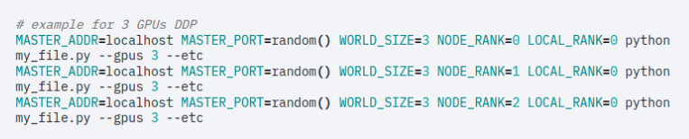

--- 
title: "Distributed Training in PyTorch"
subtitle: "Overview of some options available for multi[-node training in pytorch"
description: ""
date: "2022-08-11"
tags: [pytorch, python, distributed_training]
categories: [pytorch, python, distributed_training]

featuredImage: ""
featuredImagePreview: ""

author: "Baraa, Boda"
authorLink: ""

draft: false

---


# Distributed Training 

## Why?

 * Need more compute power to process large batches in parallel (DDP)
    - Uses collective communication
* Large model that couldn’t be fit in memory of one GPU (RPC)
    - Uses P2P communication

* All of the above XD 

## DDP in Pytorch 
* Every GPU has a model replica, controlled by a process.
* Every process fetches different batch of data.
* Forward. 
* Overlapping between computation of  and communication(broadcast - allreduced) of gradient.
* Validation 

<p align="center"> </p>


## 4 steps-recipe to Distributed Training 


### Initialize Distributed Group

```python
    init_process_group(backend='nccl')
```
### Data
 * Local Training
 ```python

 # Wrap train dataset into DataLoader
train_loader = DataLoader(train_dataset,
                          batch_size=batch_size)
 ```

 * Distributed Training
 ```python 
 # Create distributed sampler pinned to rank
sampler = DistributedSampler(train_dataset,
                             num_replicas=world_size,
                             rank=rank,
                             shuffle=True)  # May be True
# Wrap train dataset into DataLoader
train_loader = DataLoader(train_dataset,
                          batch_size=batch_size,
                          shuffle=False,  # Must be False!
                          sampler=sampler)
```

### Model
 * Local Training
 ```python 
 # Initialize the model
model = create_model()
```
 
 * Distributed Training
 ```python 
# Initialize the model
model = create_model()
# Create CUDA device
device = torch.device(f'cuda:{rank}')
# Send model parameters to the device
model = model.to(device)
# Wrap the model in DDP wrapper
model = DistributedDataParallel(model, device_ids=[rank], output_device=rank)
```
### Saving and Logging

```python
if rank == 0:
    torch.save(model.module.state_dict(), 'model.pt')
```
## DP vs DDP

### DP:  

* Can’t scale to multiple machines 
* Single Process, multiple threads  
* Module is replicated on each device, and the gradients are all summed into the original module  
* Doesn’t give the best performance, as a result of the GIL problem with multi-thread applications in python 

### DDP: 

* Can be used for Single machine, multiple GPUs training, or for multi-node training 
* It initiates process for every device (eg. 2 nodes, with 4 GPUs each = 8 processes) 
* Gradients are gathered using “all_reduce” operation 


***It’s advised to use DDP for any distributed training***


## Torch.Distributed.Launch vs Torchrun 

### Distributes Launch scripts: 

* We need to run the script on every node, with the correct ranks 
* We have to pass it all necessary environment variables

#### Example

```bash
#!/bin/bash

MASTER=$(scontrol show hostnames "$SLURM_JOB_NODELIST" | head -n 1)

#Launch the pytorch processes, first on master (first in $HOSTLIST) then on the slaves
RANK=0

for node in $HOSTLIST; do

echo "RAnk is "$RANK

srun --nodes=1 --gpus=$GPUS_PER_NODE \
python -m torch.distributed.launch   \
--nproc_per_node=$GPUS_PER_NODE \
--nnodes=$NNODES \
--use_env \
--node_rank=$RANK \
--master_addr=${MASTER} \
--master_port=$PORT \
train.py \
 arg1 \
 arg2  &

sleep 1
echo "node is" $node
echo "node id is "$RANK
RANK=$((RANK+1))
done
wait
```

***Watch out for   “&” ***

### Torchrun: 

* We run the script only once, and it runs it on all nodes  
* It adds all environment variables, and we can use them directly in the code 
 
#### Example: 
```bash
srun torchrun \ 
--nnodes=2 \ 
--nproc_per_node=$GPUS \ 
--rdzv_id=123456 \     // worker group ID 
--rdzv_backend=c10d \  // Communication library 
--rdzv_endpoint=${MASTER} \ 
test.py  
``` 

**Overall, Torchrun removes a lot of  mundane steps.**


## Hugging Face
### Option 1: using HF trainer 
* You can use HF trainer, but in this case, you need to manually run the training script on every node ( torch.distributed launch with for loop, or using torchrun once) 

### Option 2: using HF accelerator  
* You just need to run the script using the accelerate library. 
* You need to create the training loop manually, and can’t use HF trainer then 


<p align="center"> </p>


### PyTorch Lightning

* PyTorch Lightning is the easiest in running distributed training 
* We pass in the number of nodes, and number of GPUs per node to the trainer 

<p align="center"> </p>

* Calls your script internally  multiple times with the correct environment variables 
<p align="center"> </p>


## Common errors: 

### Dict names issue: 

- Problem: When we wrap our model with DDP, pytorch adds (module.dict_key) for all keys in the  state_dict  

- Solution: We need to add a function, that detect if we are running distributed training or not, and add or delete “module” from all keys accordingly 
