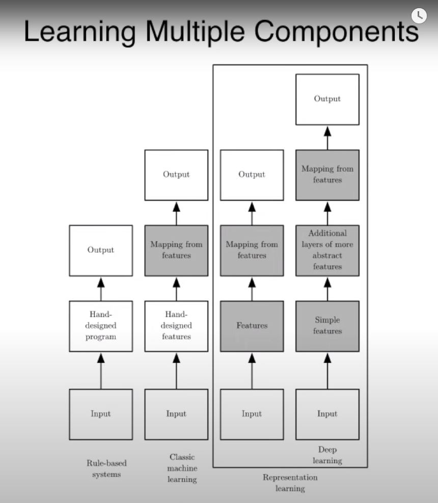

## Transformers

To deal with sequential data we have to options:

- 1-D convolution NN
  - processing can be parallel
  - not practical for long sequences
- Recurrent NN
  - can't happen in prallel
  - have gradient vanshing problem of the squence becomes so long
  - we have bottleneck at the end of the encoder
- RNN with attention mechanism
  - to solve the bottleneck problem, we make Encoder-Decoder attention
  - Decoder utilzes:
    - context vector
    - weighted sum of hidden states (h1,h2, ... ) from the encoder

### Transformers

#### Encoder

- first we do input embedding, and positional embedding
- in self attention: we multiply q,w,v by a matrix to do lenear transformation
- self attentoion: k _ q --> scaling down --> softmax --> _ v

### multi-head attention

- works as we use many filters in CNN
- in wide attention: it takes every word and spread it multi-head attention
- in narrow attention: it take every word and split it up across the multi-head
  - but didnt we lose the adcantage of using multi-head as mutli prespectives, as we do with filters in CNN?

### Positional info

- positional encoding using the rotation sin/cos matrix
- positional embedding

### Residual connections

- to give the chance to skip some learning parameters if it's better to minimize the loss

### Layer Normalization

- in batch normalization
  - ==> we normalize to zero mean and unity varince
  - we calculate for all samples in each batch (for each channel )
- in layer normalization
  - ==> $y = \gamma \* x + \beta $ where gamm and bata are trainable parametes
  - calculates for all channles in the same sample
- in instance normalization ==> calculate for one channel in one sample

## Debugging ML Models

- Understand bias-variance diagnoses

  - getting more data ==> fixes high variance
  - smaller set of features ==> fixes high variance

#### Refrence

- [Prof. Andrew NG Vid](https://www.youtube.com/watch?v=ORrStCArmP4)

## SVM and Kernels

- The main idea of kernels, is that if you can formlate the optimization problem as some of inner products of feater vectors, that can have infinite dimentions, and to come up with a way to calc these inner products efficiently

we have $ X(i) \in R^{100}$, suppose W can be expressed as a linear combintaion of X

$ W = \sum*{i = 1}^{M} \alpha*{i} y^i x^i$ (This can be proved with the representer theorem)

- vector W is perpendicular to the decsion boundry specified by algorithm, so W kinds of sets the orientation of the decision boundry and the bias moves it alont right and left.

optimization problem is :
$\min  {w,b}  {1/2} *||W||^2 $  
s.t  $y^i*((W^T * x^i) + b) >= 1$

- For SVM you can make a trade off between the margin and how much you can tolerate wrong calssified examples using a constant

## Distributed Training in Pytorch

### Pytorch DDP Internal

DDP relies on c10d ProcessGroup for communications. Hence, applications must create ProcessGroup instances before constructing DDP.
The DDP constructor takes a reference to the local module, and broadcasts state_dict() from the process with rank 0 to all other processes in the group to make sure that all model replicas start from the exact same state.
DDP registers autograd hooks during construction, one hook per parameter. These hooks will be triggered during the backward pass when the gradient becomes ready.

Backward pass: Because `backward()` function is called on the loss directly, which out of DDP's control. So, it waits till one of the autograd hooks are invoked, to trigger the gradients synchronization.

DDP waits for all gradients in one bucket are ready, Reducer kicks off an asynchronous allreduce on that bucket to calculate mean of gradients across all processes.

Optimizer Step: From the optimizer’s perspective, it is optimizing a local model. Model replicas on all DDP processes can keep in sync because they all start from the same state and they have the same averaged gradients in every iteration.

### DataParallel VS DistributedDataParallel

- `DataParallel` is single-process, multi-thread, and only works on a single machine, while `DistributedDataParallel` is multi-process and works for both single- and multi- machine training. DataParallel is usually slower than DistributedDataParallel even on a single machine due to GIL contention across threads, per-iteration replicated model, and additional overhead introduced by scattering inputs and gathering outputs.
- `DataParallel` doesn't support model parallel

#### Resources

    - https://pytorch.org/docs/master/notes/ddp.html
    - https://pytorch.org/tutorials/intermediate/ddp_tutorial.html?highlight=distributed%20training

## Complete Statistical Theory of Learning - **Vladimir Vapnik**

- There are two ways for generalization: more data, and complete learning theory
- Turing said, that you should imitate intelligent person

### Ref: https://www.youtube.com/watch?v=Ow25mjFjSmg

## Statistical Machine Learning

### part 1:

#### deduction vs induction:

- deduction: is the process of reasoning from one or more general statements to reach a logically certain conclusion. premises must be correct.
- induction: reasoning that construct or evaluates general proposition that are derived from specific examples. we can never be sure our conclusion can be wrong!
- machine learning tries to automate the process of inductive inference.

#### why should ML work?

- ML tries to find patterns in data
- we will only be able to learn if there's something to learn
- ML makes some assumptions, which are are rarely made explicit.
- we need to have an idea what we are looking for. This is called "inductive bias". Learning is impossible without such a bias
  - the formal theorem if this is called `no free lunch theorem`
- on the other hand, if we have a very strong inductive bias, then with just few training examples, then we can have high certainty in the output
- the problem of selecting a good hypothesis class is called model selection.
- any system that learns has an inductive bias.
- if the algorithm works, **THERE HAS TO BE A BIAS**
- the inductive bias, rules over our function space

### Part 2:

- it;s not hard for ML algorithm to correctly predict training labels
- usually ML algorithms make training errors, that is the function,they come up with doesn't perfectly fit the training data
- what we care about is the performance on teh test set
- it's not always the case that lowering the train data would lower that test data

#### K-Nearest algorithms:

- for K-nearest algorithm,
  - the best value for K is log(N)
  - if k is too small ==> overfitting
  - if k is too large ==> underfitting
- k nearest algo achieves good results on MNIST dataset for classifying two classes, with simple euclidean distance function
- k-nearest can be used for density estimation, clustering, outlier detection
- the inductive bias in K nearest algo, is that near points are the of teh same category
- the challenging part about k nearest algo is how to measure the distance between points

### Part3

- for ML, we don't put any assmuptions for the data probability ditribution
- often, the input and output are random variables
- in some applications, it's important that the loss depends on the input X.
- also in some cases, the type of error is critical, for exp. spaam detection
- Bayes risk: is the min error for the expected values over all examples --> basically the it's the lowest error you can achieve
- Consistency: we say algorithm A is consistent, if we have an infinite iid datapoints, and the risk of algorithm's selected function converges to the Baye's risk.
  - basically means that if we have infinite data samples, then our algorthms reaches the Bayes risk, which is the lowest error possible
- Universally consistent: no mattter the underlying probability distribution is, when we have enough data points, the algorithm would be consistent
  - consistent independantly of the data distribution
  - KNN classifier, SVM, boositn, random forests are universally consistent

## DL Book

### CH1

- one of the key ideas in DL is that data representation matters a lot, and that DL is a technique for learning how to represent the data

### AI

- in AI we need the computer to do some tasks like humans
- we do that by providing the computer with a lot of rules describing the world and how to act in different scenarios

### ML

- in machine learning we can learn these rules without explicitly told them
- but we still need to be provided with custom features that are given by domain experts

### Representation learning

- a specific type of ML where we don't tell the computer the specific features
- instead, we give the computer raw input, and it should learn the more complex features explicitly
- ex: autoencoders

### DL

- is a representation learning algorithms that is applied in multi sequential manner

### CH2

## Deep Generative Modeling

- latent variable: it's a variable that is controlling some behaviors, but we can't directly observe it
- we are trying to observe `true explanatory factors`, for example, `latent variables`, from only observed data

### Autoencoders:

- the encoder learns to map from data, to a low-dimensional latent space
- the decoder learns to map back from the low-dimensional space back into a reconstructed observation
- the bottleneck hidden layer forces the network to learn a compressed latent representation
- the reconstruction loss forces the latent representation to capture as much information from the data

### Variational Autoencoders (VAE)

- with classic autoencoders, once we train the network, then the latent representation is deterministic
- but in VAE, we add some randomness, so we can generate new samples
- so the encoder should output a mean and a standard deviation, which represents a distribution of the input, then we can sample from this distribution to generate new sample
- the encoder is trying to infer a probability distribution of the latent space with respect to its input data
- the decoder is trying to infer a new probability distribution over the input space given the latent space
- the loss is going to be function of the parameters of the two distributions
- the loss would consist of a construction loss and a regularization term, which is responsible for inducing some notion of structure of this probabilistic space
- We need regularization and a prior to:
  - continuity: points that are close in the latent space, should remain close after decoding
  - completeness: samples from the latent space, should produce meaning content after decoding
- we can't perform back propagation, as there's stochasticity in the latent space,
- to solve this issue, we fix, the mean and variance, and introduce the stochastic term separate from them

- The key problem with VAEs, is a concern of density estimation

### Generative Adversarial Networks (GANs)

- we need to sample from a very complex distribution, that we don't know, and can't estimate
- the solution, is to sample from a simple distribution (eg. noise), then learn a transformation, to the data distribution
- we have a Generator, that's tries to transform the data sampled from the random noise, into data that looks real, to trick the discriminator
- we have a discriminator, which tries to identify real data from fake.

## SubWords

- it's just like the skip-gram model
- but we just changed the score function
- so that we increased the vocab size by adding N-grams of all words we have
- then we use them to capture more meaning from the words
- if we encounter new word, then we add it's N-gram and thats would be the word vector

## Decision Trees

- they are greedy algorithm
- they can stuck in local minimum
- if the we have some continuous features, we can use it multiple times, every time with different range

## Purity function

- we want to define a purity function, that has the following
  - it has it's maximum value when probability of any class in 1
  - it has it's minimum value when all classes has the same probability
  - Purity( pa, pb) == Purity (pb, pa)
- entropy = impurity = -1 \* purity
- one function that satisfies all these requirements, is

  - $ purity(p*{c1}, p*{c2}, p*{c3}) = p*{c1} \log(p*{c1}) \* p*{c2} \log(p*{c2}) \* p*{c3} \log(p\_{c3})$

- so we choose features, that would increase purity the most after splitting the dataset using it
- to calculate after entropy or purity of a set after seperation, would be the weighted average of the subsets

## Why going deep in Deep Learning

- one motivation, is that going deep can reduce the size of our units exponentially
- in our underlying function, there could be some symmetry, that we can fold the function across its axis
- for statistical reasons, we would want to infer out initial beliefs, about our function, that is involve the composition of several simpler functions
- Empirical experiments show that deeper networks generalize better

## Few-shot Learning

- we want to classify examples, that we only have few examples for, maybe even 0
- the idea is instead of having a classifier as the last layer(softmax layer), we can use a siamese network, just to tell us is the two examples are similar
- so we just learn a similarity function

## GLIDE:

- Generates realistic images from text
- GLIDE is the next version of DALLE, with respect to photo realism and caption similarity
- this is fine-tuned model, not zero-shot like DALLE
- It can generate or edit images
- so you can generate an image using zero-shot, then you can edit the image by putting masks on the image and tell the model what to draw in the masked area

### Diffusion Models

- we start with the original image, then we keep add noise to it till it become so noisy
- then we try to reverse the operation and get it back to the input image

## P vs NP

- P = problems solvable in polynomial time
- NP = decision problems solvable in nondeterministic polynomial time
  - decision problems = yes, no problems
  - NP problems are hard to solve, but each to check the correctness of the answers

## Expectation Maximization

- If we have a probability distribution that is function of two variables, one is observable and the other is latent and we want to calculate the MLE for this model.
- Then we can calculate the marginal likelihood instead
- The marginal probability basically means that we take the summation over all possible states of the latent variable

### How it works

- you have some samples, and you want to cluster them according to two distributions
- you init the two ditros, randomly, and calculate the postrior that every sample belong to this distro
- then you take the weighted average that every one of thees samples belong to the distro

- it's like K-means except that we have probability that every sample belong to a distro, instead of 0-1

- we keep iterating till we reach the most accurate distros

## CTC Loss

- when we have many-to-many sequence prediction
- Labeling order matters , but there's no one-to-one correspondence between outputs and labels
- we need to impose structural constraints on the output sequence
- Mostly used with speech recognition, where we have labels much less that input
- they have a special blank token, and they reduce all similar tokens in the same span between blanks with one token

## Contrastive loss

- In cross-entropy loss, all we care about is make similar images in the same side of the decision boundry
- But in contrastive loss, we first try to move all similar examples near each other, so then we can train the calssification layer easily
- in case of self supervised learning, there can be a probelm of taking a postive example as a negative one, because we don't have labeled data, which can make it hard on downstream tasks

### How it works

- we have the original image, and they call it the anchor
- they augment this anchor image to obtain the positive examples
- for each anchor, they generate one positive pair, and 2N-2 negative pairs
- they calculate the dot product similarity between the anchor and these pairs
- they take the log for the similarity of the anchor and the positive example in the numerator, and the summation of the similarity between the anchor and negative examples in the denomerator
- so our objective is increasing the enumerator and decreacing the denomerator
- They also apply temperature smoothing
- This is can be also extended to supervised contrastive
  - we can have more than one positive label
  - we can have multiple anchor classes
- we can see the anchor-positive similarity appears in the gradients, and this makes the gradient the biggest for hard-positives (positive examples that the model didn't learn the similarity between yet)

## MAP - Maximum a posteriori

- Tries to estimate the best parameters given the likilhood on the data, and the prior of the parameters

### Pros:

- easy interpretable
- avoid overfitting (has regularization )
- tends to look like MLE asymptotically

### Cons

- point estimate, no representation of uncertainty in Theta
- not invariant under reparameterization (meaning that if we mapped Theta using a function, then the new MAP value will not simply be the paramterized value on the old MAP value)
- must assume prior on Theta

## Activation Checkpointing

- normally we store the activations for all layers, because we need them in the backward path
- for large models, this can cause huge memory footprint
- The idea is to only store the activation for the last layer in each block
- and then recalculate the activations for the other layers when we need them

# Loss Scalling

- in half-precision training, some small values are rounded to zero, bacause of the representation limitation of FP16

- but we can just scale the loss, by multiplying it with certain value,and so the gradients would be scaled as well
- this trick enables us to cover larger range of values
- for ex, if we scaled the loss by factor of 8, then extend the covered range with 3 exponents (2^3)

## ZeRO

- The main idea is in Data parallel, why copy state of optimizer and weights and gradients to all devices, while you can partition them
- the idea is to partition all those over the devices, so that teh total memory would reduce dramatically

- This works because these states (optimizer, weights, gradietns) are temporal independent, meaning that we don't the whole matrix to calculate teh local step

## PaLM

- Outperformed finetuned SOA models
- breakthroughs multi-step reasoning
- efficient utilization

## Chain of Though Prompting

- instead of doing standard prompting, they did chain of thought prompting
- they just provide the model with the chain of thought on how to generate the answer

 

## HuBert

- the main idea is that they wanted to do MLM like bert, but that's challenging with audio.
- so they first applied MFCCs to convert the audio signal into chunks
- then they applied offline K-means algorithm to cluster each frame
- so basically the labels comes from an unsupervised teacher which is the k-means
- they applied the k-means on the MFCC
- the main insight of why this works, is that the K-means algorithm is consistent, so the model learns more of the sequential structure of the data

## Graphical models

- to solve the marginal probability over the latent variable, we have two options:
  - monte carlo inference
    - this method is unbiased, but have high variance
  - Variational inference
    - this is very lowe variance, but is biased

### Variation Inference

- we can't calculate the original postrior
- so we estimate it using another approximation, that is tractable, and we tweak it till it becomes like the original intractable distribution

**if you maximize the lower bound of a function, you maximize that function**

## VQ VAE

- they applied sigmoid to the random variable to make it only takes confined range, istead of having values outside of pixels values range

## Teacher forcing in RNN

- it's a technique used to train randomness
- it's applicable only in case we have output-to-hidden connections, and it can't be used in hidden-to-hidden connections
- the main idea is that they use the true label from last step instead of the output. This way, we can parallelize the training
- biggest disadvantage to this, is that it can't be used with `open loop`, meaning in case we enter the models's output as input. because this way, there will be some inputs as test time that the model didn't see at training.

## Parti

- it's autoregressive Text-to-Image model
- it uses transformer based image tokenizer
- they can have detailed image description from dataset designed for vision-impaired people

### steps

- first they train image tokenzier, which converts images to tokens
- then they train encoder-decoder model to do teacher-inforcing style training from the sentence tokens

## Faster RCNN

- it's fast because they merged the the feature map for Region Proposal Network and the classifier network

- they pass on the extracted feature map with 3\*3 sliding window
- for every anchor point he tries to generate 9 anchor boxes

### questions

- what if this anchor point doesn't have a ground truth? we only consider the first term of the loss, which is the objectivity. and we exclude the second term as we don't have ground truth for this pixel
- why do we make intermediate anchor boxes? it's like adding a prior knowledge, we normalize our predictions and ground truth according to these anchors

## How to choose validation sets

> This is taken from Dr. Rachel's blog post [here](https://www.fast.ai/posts/2017-11-13-validation-sets.html)

- the most common way is to choose a random subset from the training set.
- but this doesn't always give the best results in real world

### Cases when is a random subset not good enough?

- Time series models
  - it's better here to choose continuous intervals as val or test
- when you dataset has many instances of the same object (ex: same person, same car ). and your task is not detecting the object, but rather the action or the environment.
  - so if you didn't take all the pictures from the same object in one split of the data, there's a high chance your model would learn features related to the object and not the action
  - so we want to gather all dataset examples of the same object in the same split (train, or val)

## Masked RCNN

### why pyramid network
- we want to have good semantic understanding but in high resolution 
- it's so computationally expensive 
- we use it as a backbone for FasterRCNN
  - question? how do we use it as a backbone?

- The main idea is that they seprated the mask predictor  from, classification and bounding box detection 